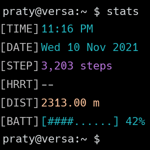

# Terminal for Fitbit
Based on [jdhartley's amazing watchface](https://github.com/jdhartley/terminal-for-fitbit), HorizonTerminal is a clock face styled to match a terminal session in a Unix environment, with the `Horizon` color scheme implemented.

## Screenshots
### Versa, Versa 2

## Changelog
- Changed the date format to dd/mm/yyyy
- Tweaked the units to be all-metric
- Rewrote the default theme
- Changed the displayed command to `stats`

## Credits
- Inspired by quarlow's [amazing terminal watchface](https://www.reddit.com/r/unixporn/comments/9ndo8o/oc_always_keep_some_terminal_with_you/) for Galaxy Gear/Wear OS, nsmith543's [terminal watchface](https://github.com/nsmith543/terminal) clone for Garmin watches, and Dr_Schmoctor's [terminal watchface](https://amazfitwatchfaces.com/bip/view/?id=15384) clone for Amazfit Bip.
- [FitFont for Fitbit](https://github.com/gregoiresage/fitfont) (seriously, thank you so much Grégoire)
- [Source Code Pro Medium](https://github.com/adobe-fonts/source-code-pro)
- Fitbit's open source [Moment clock face](http://github.com/fitbit/sdk-moment)
